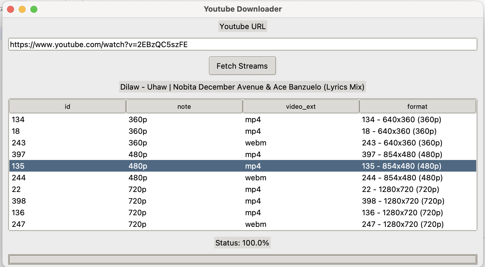

# Simple Youtube Downloader

A simple GUI app utilizing yt-dlp for downloading youtube videos.



## Clone the repository

```
git clone https://github.com/alexiusacademia/youtube-downloader.git
```

## Navigate to the downloaded folder

```
cd youtube-downloader
```

## Create a virtual environment

For example, using virtualenv

```
virtualenv venv
```

Then activate

## Install the dependencies

```
pip install -r requirements.txt
```

## Run the program

```
python main.py
```
